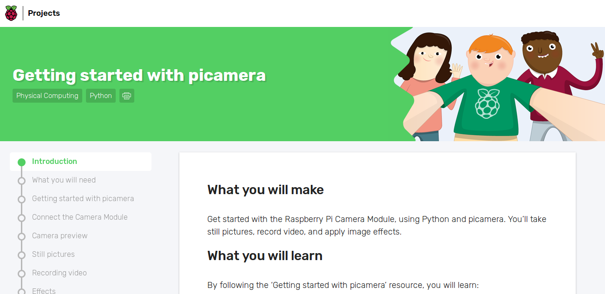

# Raspberry Pi Camera

# Contents
- Good sites

# 
```
$ sudo raspi-config
```

# Streaming
- <a href="http://picamera.readthedocs.io/en/latest/recipes2.html#web-streaming">4. Advanced Recipes — Picamera 1.13 Documentation</a>
- <a href="https://randomnerdtutorials.com/video-streaming-with-raspberry-pi-camera/">Video Streaming Raspberry Pi Camera | Random Nerd Tutorials</a>

# Good sites
- <a target="_blank" href="https://projects.raspberrypi.org/en/projects/getting-started-with-picamera">Getting started with picamera - Introduction | Raspberry Pi Projects<br></a>


